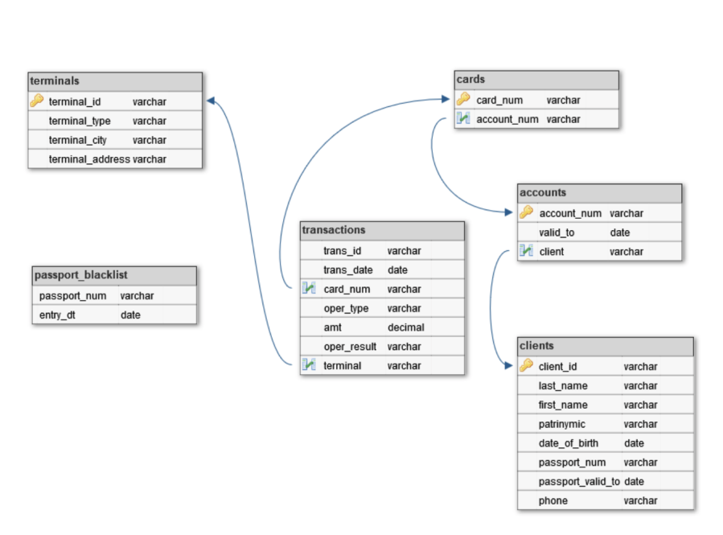

# Пример построения ETL с инкрементальной загрузкой

- Запуск сборки приложения
```commandline
docker-compose up -d
```

При запуске выполняется скрипт ./data/sql/ddl_dml.sql
И дополняются зависимости из файла requirements.txt

- Airflow (логин: admin, пароль: admin)
```
http://localhost:8080
```

- MinIo (логин: admin, пароль: your_strong_password)
```
http://localhost:9001
```

- Extra Fields JSON
```
{
  "endpoint_url": "http://minio:9000"
}
```

## Описание задачи.
Разработать ETL процесс, получающий ежедневную выгрузку данных (предоставляется за 3 дня), загружающий ее в хранилище 
данных и ежедневно строящий отчет.

## Выгрузка данных.
Ежедневно некие информационные системы выгружают следующие файлы:  
Список транзакций за текущий день. Формат – CSV.  
Список терминалов полным срезом. Формат – XLSX.  
Список паспортов, включенных в «черный список» - с накоплением с начала месяца. Формат – XLSX.  
Сведения о картах, счетах и клиентах хранятся в СУБД Oracle в схеме BANK.  
Вам предоставляется выгрузка за последние три дня, ее надо обработать.

## Структура хранилища.
Данные должны быть загружены в хранилище со следующей структурой
(имена сущностей указаны по существу, без особенностей правил
нейминга,
указанных далее):



Типы данных в полях можно изменять на однородные если для этого есть
необходимость. Имена полей менять нельзя. Ко всем таблицам SCD1
должны быть
добавлены технические поля create_dt, update_dt; ко всем таблицам SCD2
должны быть добавлены технические поля effective_from, effective_to,
deleted_flg.

## Построение отчета.
По результатам загрузки ежедневно необходимо строить витрину
отчетности по мошенническим операциям. Витрина строится
накоплением,
каждый новый отчет укладывается в эту же таблицу с новым report_dt.
В витрине должны содержаться следующие поля:
- event_dt
Время наступления события. Если событие наступило по
результату нескольких действий – указывается время действия,
по которому установлен факт мошенничества.
- passport
Номер паспорта клиента, совершившего мошенническую
операцию.
- fio
ФИО клиента, совершившего мошенническую операцию.
- phone
Номер телефона клиента, совершившего мошенническую
операцию.
- event_type
Описание типа мошенничества.
- report_dt
Время построения отчета.

## Признаки мошеннических операций.
- Совершение операции при просроченном или заблокированном
паспорте.
- Совершение операции при недействующем договоре.
- Совершение операций в разных городах в течение одного часа.
- Попытка подбора суммы. В течение 20 минут проходит более 3х операций со следующим шаблоном – каждая последующая меньше 
предыдущей, при этом отклонены все кроме последней. Последняя операция (успешная) в такой цепочке считается мошеннической.

## Правила именования таблиц.
Необходимо придерживаться следующих правил именования (для автоматизации проверки):
- STG_<TABLE_NAME> - Таблицы для размещения стейджинговых таблиц (первоначальная загрузка), промежуточное выделение 
инкремента если требуется. Временные таблицы, если такие потребуются в расчете, можно также складывать с таким именованием. 
Имя таблиц можете выбирать произвольное, но смысловое.
- DWH_FACT_<TABLE_NAME> - Таблицы фактов, загруженных в хранилище. В качестве фактов выступают сами транзакции и 
«черный список» паспортов. Имя таблиц – как в ER диаграмме.
- DWH_DIM_<TABLE_NAME> - Таблицы измерений, хранящиеся в формате SCD1. Имя таблиц – как в ER диаграмме.
- DWH_DIM_<TABLE_NAME>_HIST - Таблицы измерений, хранящиеся в SCD2 формате (только для тех, кто выполняет усложненное задание). 
Имя таблиц – как в ER диаграмме.
- REP_FRAUD - Таблица с отчетом.
- META_<TABLE_NAME> - Таблицы для хранения метаданных. Имя таблиц можете выбирать произвольное, но смысловое.

## Обработка файлов
Выгружаемые файлы именуются согласно следующему шаблону:
- transactions_DDMMYYYY.txt
- passport_blacklist_DDMMYYYY.xlsx
- terminals_DDMMYYYY.xlsx
Предполагается что в один день приходит по одному такому файлу. После загрузки соответствующего файла он должен быть 
переименован в файл с расширением .backup чтобы при следующем запуске файл не искался и перемещен в каталог archive:
- transactions_DDMMYYYY.txt.backup
- passport_blacklist_DDMMYYYY.xlsx.backup
- terminals_DDMMYYYY.xlsx.backup

Желающие могут придумать, обосновать и реализовать более технологичные и учитывающие сбои способы обработки (за это будет повышен балл).

## Проверка результата.
Проверка задания состоит из нескольких частей, обязательных к одновременному выполнению.
В ЦДПО выкладывается zip-архив, содержащий следующие файлы и
каталоги:
- main.py (Файл, обязательный)
Основной процесс обработки.
файлы с данными (Файл, обязательный)
Те файлы, которые вы получили в качестве задания.
- archive Каталог, обязательный)
Пустой, сюда должны перемещаться отработанные файлы
- sql_scripts Каталог, необязательный)
Если вы включаете в main.py какие-то SQL скрипты, вынесенные в
отдельные файлы – помещайте их сюда.
- py_scripts Каталог, необязательный)
Если вы включаете в main.py какие-то python скрипты, вынесенные в
отдельные файлы – помещайте их сюда.

## Критерии выставления оценки:
- Структурированность кода – восприятие кода (отступы, табуляции), комментирование, разделение на отдельные файлы логических 
блоков. До 10%. Качество обработки инкремента. Инкремент должен выделяться правильно, максимально эффективно и без лишних 
операций, контроль проводится в том числе автоматически по нескольким операциям. До 15%.

- Общая сложность процесса обработки данных. При выполнении задания необходимо придерживаться стандартов, изученных в курсе. 
Необоснованное ухудшение процесса обработки будет снижать балл. Приветствуется использование изученных алгоритмов загрузки 
данных в хранилище, использование метаданных. До 40%, причем если вы используете только SCD1 – то до 15%.

- Качество получаемого результата. Необходимо найти все предусмотренные мошеннические операции. У нас заготовлено 7 проверок 
4 позитивных примера и 3 контрпримера), по 5% за каждую найденную операцию. Мошеннических операций может быть больше, 
но контролируются 7 из них. Итого до 35%.

- Дополнительные баллы за сложность. Проверяющий оставляет за собой право добавлять до 25% дополнительных баллов за 
дополнительное полезное улучшение (и усложнение) проекта.

Минимальные требования, для того чтобы мы считали проект успешно выполненным – успешная загрузка одной фактовой таблицы 
и одной таблицы измерений, отлов хотя бы одного случая мошенничества в отчете и минимальный балл за все задание 35%.